<!-- Header Wave -->

  

<!-- Typing Animation -->

  

  
  

---

## 💼 Currently

<table>
  <tr>
    <td>
      
    </td>
    <td>

🧠 &nbsp;**Junior AI Engineer** @ **RapidsAI** &nbsp;·&nbsp; *Oct 2026 – Present*

🤖 &nbsp;Building **multi-agent harnesses** — supervisor routing + specialized sub-agents

🕸️ &nbsp;Shipping **GraphRAG** over Neo4j knowledge graphs with hybrid retrieval

🛡️ &nbsp;Evaluating & red-teaming LLM systems for **production reliability**

🎓 &nbsp;Software Engineering @ **NUST**

</td>
</tr>
</table>

---

## 🛠️ Tech Stack

### Languages
<picture>
  <source media="(prefers-color-scheme: dark)" srcset="./assets/stack-languages-dark.svg" />
  <source media="(prefers-color-scheme: light)" srcset="./assets/stack-languages-light.svg" />
  
</picture>

### Machine Learning
<picture>
  <source media="(prefers-color-scheme: dark)" srcset="./assets/stack-ml-dark.svg" />
  <source media="(prefers-color-scheme: light)" srcset="./assets/stack-ml-light.svg" />
  
</picture>

### LLM & Generative AI
<picture>
  <source media="(prefers-color-scheme: dark)" srcset="./assets/stack-llm-dark.svg" />
  <source media="(prefers-color-scheme: light)" srcset="./assets/stack-llm-light.svg" />
  
</picture>

### Backend & Web
<picture>
  <source media="(prefers-color-scheme: dark)" srcset="./assets/stack-web-dark.svg" />
  <source media="(prefers-color-scheme: light)" srcset="./assets/stack-web-light.svg" />
  
</picture>

### Databases
<picture>
  <source media="(prefers-color-scheme: dark)" srcset="./assets/stack-db-dark.svg" />
  <source media="(prefers-color-scheme: light)" srcset="./assets/stack-db-light.svg" />
  
</picture>

### Developer Tools
<picture>
  <source media="(prefers-color-scheme: dark)" srcset="./assets/stack-tools-dark.svg" />
  <source media="(prefers-color-scheme: light)" srcset="./assets/stack-tools-light.svg" />
  
</picture>

---

## 📊 GitHub Stats

  
  

  

  

---

## 📫 Let's Connect

  
  
  

---

<!-- Snake Animation (generated by .github/workflows/snake.yml) -->

  <picture>
    <source media="(prefers-color-scheme: dark)" srcset="https://raw.githubusercontent.com/najiahkhalid/najiahkhalid/output/github-snake-dark.svg" />
    
  </picture>

<!-- Footer Wave -->

  

